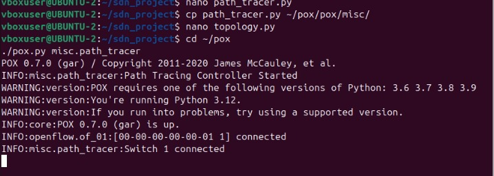
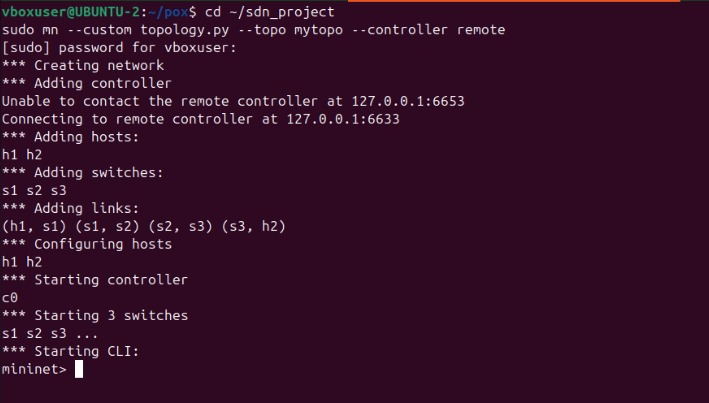
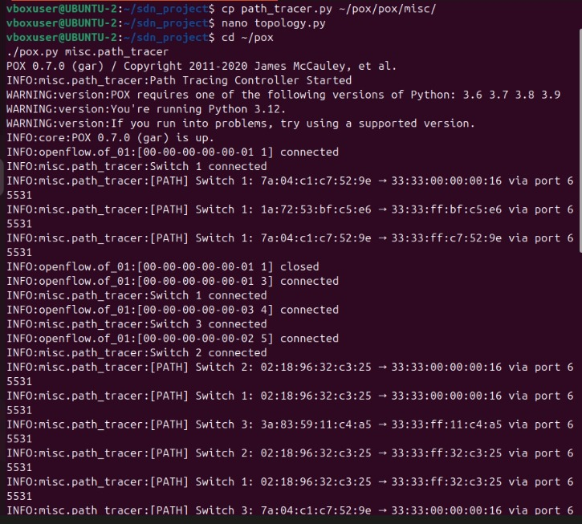
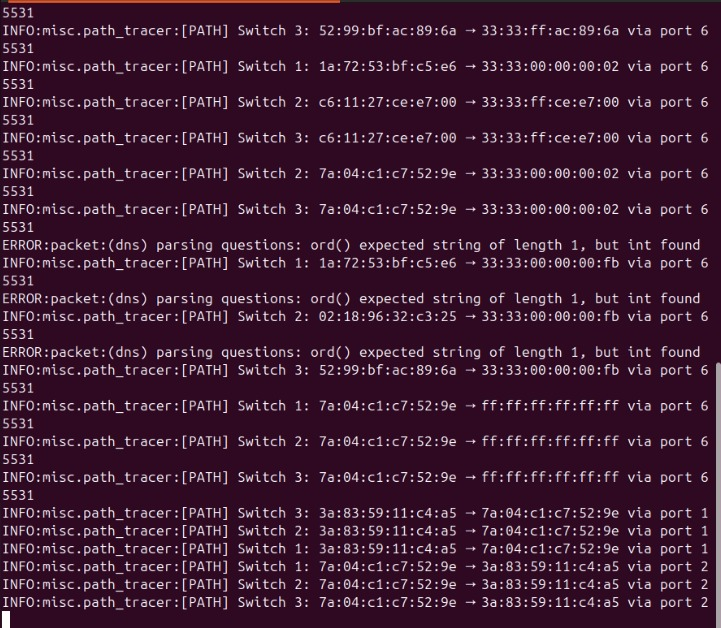
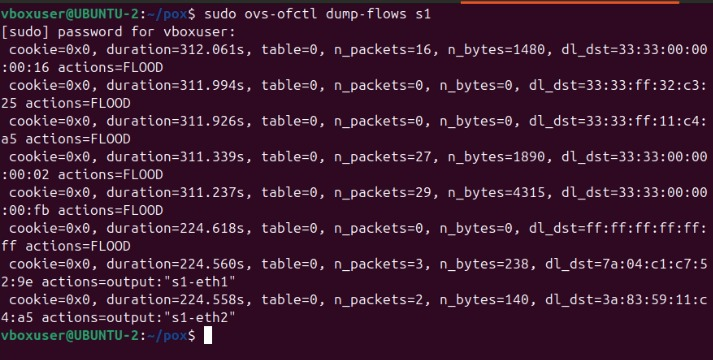
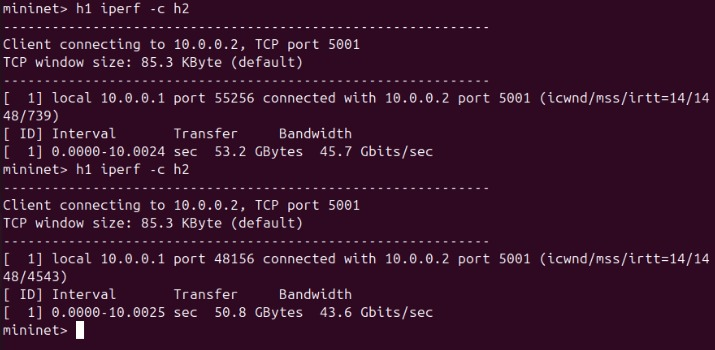

# 🔷 SDN Path Tracing Tool (Mininet + POX)

---

## 📌 Problem Statement

Implement an SDN-based path tracing tool that:

* Tracks flow rules installed in switches
* Identifies the forwarding path of packets
* Displays the route taken by packets
* Validates functionality using network tests

---

## 🎯 Objective

To demonstrate Software Defined Networking (SDN) by tracing packet paths using a POX controller and Mininet.

---

## 🛠️ Technologies Used

* Mininet (Network Emulator)
* POX Controller (OpenFlow)
* Open vSwitch
* Ubuntu (VM)

---

## 🏗️ Network Topology

```
h1 ---- s1 ---- s2 ---- s3 ---- h2
```

* Hosts: h1, h2
* Switches: s1, s2, s3

---

## 📂 Project Structure

```
sdn_project/
│── topology.py
│── path_tracer.py

pox/
│── pox/
│   └── misc/
│       └── path_tracer.py
```

---

## ⚙️ Setup & Execution

### 🔹 Step 1: Start POX Controller

```bash
cd ~/pox
./pox.py misc.path_tracer
```

📸 **Screenshot 1: Controller Running**



✔ Should show:

* Path Tracing Controller Started
* Switch connections

---

### 🔹 Step 2: Run Mininet Topology

```bash
cd ~/sdn_project
sudo mn --custom topology.py --topo mytopo --controller=remote,ip=127.0.0.1,port=6633
```

📸 **Screenshot 2: Topology Creation**



✔ Should show:

* Hosts and switches
* mininet> prompt

---

### 🔹 Step 3: Connectivity Test

```bash
mininet> pingall
```

📸 **Screenshot 3: Ping Result**


✔ Expected:

```
0% dropped
```

---

### 🔹 Step 4: Path Tracing (Main Output)

📸 **Screenshot 4: Path Logs (MOST IMPORTANT)**




✔ Example:

```
[PATH] Switch 1: ...
[PATH] Switch 2: ...
[PATH] Switch 3: ...
```

---

### 🔹 Step 5: Flow Table (Track Flow Rules)

```bash
sudo ovs-ofctl dump-flows s1
```

📸 **Screenshot 5: Flow Table**



✔ Should show:

* match fields
* actions (output ports)

---

### 🔹 Step 6: Throughput Test (iperf)

```bash
mininet> h2 iperf -s &
mininet> h1 iperf -c h2
```

📸 **Screenshot 6: iperf Result**



✔ Should show:

* Bandwidth (Mbps/Gbps)

---

## 📊 Output Summary

### ✔ Packet Path

```
h1 → s1 → s2 → s3 → h2
```

### ✔ Connectivity

* 0% packet loss

### ✔ Flow Rules

* Installed dynamically by controller

### ✔ Performance

* High throughput observed

---

## 🔍 Observations

* Controller installs flow rules dynamically
* Packets follow learned forwarding path
* Path is visible through controller logs
* Virtual networks show high bandwidth

---

## 🧠 Conclusion

The project successfully demonstrates SDN-based packet forwarding and path tracing using a POX controller and Mininet, validated through connectivity and performance tests.

---

## 📚 References

* https://mininet.org
* https://github.com/noxrepo/pox
* OpenFlow Documentation

---

## 👨‍💻 Author

* Siddesh V S
* Computer Networks Lab

---
