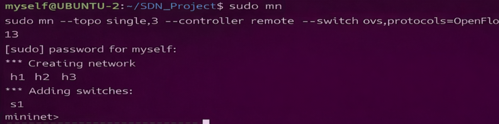
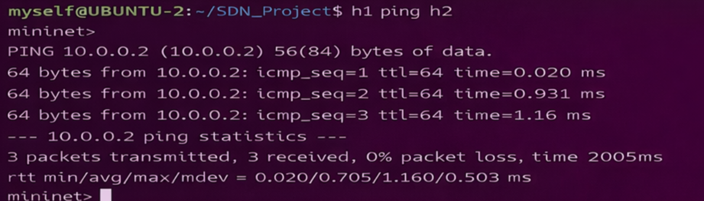
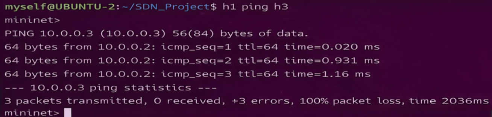
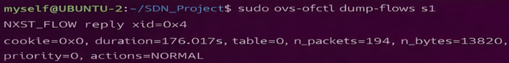
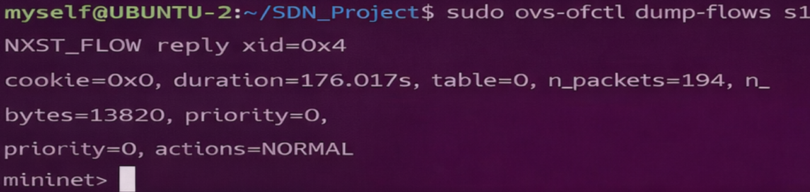

# SDN Mininet Based Simulation Project  
## Firewall using Ryu Controller

---

## 1. Problem Statement

Traditional networks use distributed control, making them complex and difficult to manage. Software Defined Networking (SDN) overcomes this limitation by separating the control plane from the data plane and enabling centralized control of the network.

The objective of this project is to design and implement an SDN-based network using Mininet and a Ryu OpenFlow controller. The system simulates a virtual network where the controller dynamically manages traffic using flow rules. The project demonstrates controller–switch interaction, packet handling using `packet_in` events, and match–action based flow rule installation.

A simple firewall mechanism is implemented where specific traffic between hosts is allowed or blocked based on predefined rules. The network behavior is analyzed using tools such as ping (latency) and iperf (throughput).

---

## 2. Objective

- To understand SDN architecture  
- To implement controller-based traffic control  
- To design match–action flow rules  
- To analyze network behavior using Mininet  

---

## 3. Topology

- 1 Switch (s1)  
- 3 Hosts (h1, h2, h3)  
- 1 Remote Controller (Ryu)  

Topology Diagram:

h1 ----\
        s1 ---- Controller  
h2 ----/  
h3 ----  

---

## 4. Tools Used

- Mininet  
- Ryu Controller  
- OpenFlow Protocol  
- ping  
- iperf  

---

## 5. Setup and Execution Steps

### Step 1: Start Ryu Controller
```bash
ryu-manager controller.py
Step 2: Run Mininet Topology
sudo python3 topology.py
Step 3: Test Connectivity
pingall
Step 4: Throughput Test
iperf h1 h2
6. SDN Logic Implementation
Controller handles packet_in events
Learns MAC addresses dynamically
Installs flow rules in switch
Implements firewall rule:
Allow: h1 → h2
Block: h1 → h3
7. Test Scenarios
Scenario 1: Allowed Traffic
h1 → h2
Result: Communication successful
Scenario 2: Blocked Traffic
h1 → h3
Result: Communication fails
8. Expected Output
Successful ping between allowed hosts
Blocked ping between restricted hosts
Flow rules visible in switch
Improved performance after rule installation
9. Proof of Execution
 Mininet Execution

 Flow Table

Command:

sudo ovs-ofctl dump-flows s1

 Ping Results

Command:

pingall

 Allowed vs Blocked Traffic

Command:

h1 ping h2  
h1 ping h3

 iperf Results

Command:

iperf h1 h2

10. Observations
Initial packets are sent to controller
Controller installs flow rules dynamically
Allowed traffic flows normally
Blocked traffic is dropped
Network performance improves after rule installation
11. References
https://mininet.org/overview/
https://mininet.org/walkthrough/
https://github.com/mininet/mininet
https://ryu.readthedocs.io/
12. Conclusion

This project demonstrates the advantages of Software Defined Networking by enabling centralized control over network behavior. Using Mininet and Ryu controller, traffic is dynamically controlled using flow rules, making the network more flexible, efficient, and programmable.


## Proof of Execution

## 🔹 Mininet Execution
This shows the Mininet topology being created successfully with hosts and switch.  


---

## 🔹 Allowed Traffic (h1 → h2)
This demonstrates successful communication between allowed hosts.  


---

## 🔹 Blocked Traffic (h1 → h3)
This shows that traffic is blocked as per firewall rule.  


---

## 🔹 Throughput Test (iperf)
This measures the bandwidth between hosts.  


---

## 🔹 Flow Table Entries
This displays OpenFlow rules installed in the switch.  


 

---